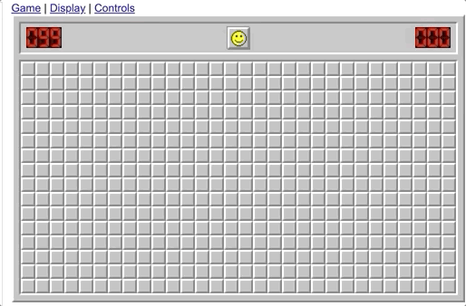

# Project 2 - Minesweeper

## Project Outcomes:
Develop a C++ program that uses:
* Dynamic memory
* Multi-dimensional arrays
* Recursion
* Searching
* Your brain :smile:

## Preparatory Readings:
ZyBooks chapters 10-12.

## Background Information:
### Project Overview:
Minesweeper, like most video games, is a complete waste of time, thus, historically people have spent **tons** of time playing it.
Up until Windows 8, Minesweeper came pre-installed on all Windows devices.
It can still be downloaded from the Windows App Store, or it can be played online, at links such as http://minesweeperonline.com/#beginner.

Your task for this project will be to create a playable version of Minesweeper.
Our version will be displayed using a table and some basic display characters, see [example below](#sample-board-display).

Make sure that whichever characters you choose make it clear what the [status of the cell](#how-is-minesweeper-played) is.

#### How is Minesweeper Played
The goal of Minesweeper is to clear a minefield of its mines.
If you are not at all familiar with the game, please fiddle around with it a bit to gain full understanding http://minesweeperonline.com/.
Generally there are 4 cell types that will require unique actions when clicked.
1. If you accidentally check a location that has a mine, the mine explodes and the game is over.
1. If you check a location that does not have a mine, and none of its 8 adjacent locations have mines either, that cell should display 0 , or something similar, to indicate that the location has been cleared of mines.
	1. In addition, all adjacent locations that are not mines will be automatically cleared.
	This action should recursively apply to its neighbors and so on until the entire region is cleared.\
	
1. If you check a location that has 1 mine in the 8 cells that surround it, it should display 1.
	1. If 2 mines exist in the cells surrounding the location you checked, you should display 2, and so on.
1. If you believe that a cell will have a mine, you can flag the cell.
This does not make the mine explode but makes it clear that a mine is expected to exist there.

Once all cells except the mines have been checked, the minefield is considered "cleared" and you win.


### Project Requirements:
Your application must function as described below:
1. Your program should prompt the user for the name of an input file to use.
1. That input file should be read in and used to create the game board.
1. Game play continues by showing the user the current status of the board and asking for their next move.
	1. Moves can be one of two types:
		1. Click a cell, for example `c 2 3` shall search the cell at row 2, column 3.
		1. Toggle the placement of a flag, e.g. `f 16 0` would place a flag at the cell in row 16, column 0.
		If a flag already exists at that location, then remove the flag.
	1. Any invalid move a user makes should be reported to the screen somehow.
	Invalid moves are placing a flag or clicking a cell that has already been "cleared".
	Additionally, moves other than `c` and `f`, or attempting to interact with cells that are outside the game board are invalid.

#### Sample Board Display
```
    0   1   2   3
  +---+---+---+---+
0 | 0 | 0 | 1 | 1 |
  +---+---+---+---+
1 | 1 | 1 | 2 |   |
  +---+---+---+---+
2 | ⚑ | 2 | 4 |   |
  +---+---+---+---+
3 | 2 | ⚑ | 3 |   |
  +---+---+---+---+
```


#### Sample data
The input data will just be a file filled with spaces and asterisks.
A space indicates an empty cell, while an asterisk indicates a mine.
The input that would create the [sample board display](#sample-board-display) above can be found in [fourXfour.in](fourXfour.in) and looks like this:
```
    
   *
*  *
 * *
```

### Implementation Notes:
1. Create a project that is object oriented, therefore there should be several classes, all with .hpp and .cpp definitions.
2. The input file will match the exact format given above.
3. Check the rubric in Canvas and make sure you aren't setting yourself up to miss out on some points.

### Submission Requirements:
1. All code must be added and committed to your local git repository.
2. All code must be pushed to the GitHub repository created when you "accepted" the assignment.
	1. After pushing, with `git push origin master`, visit the web URL of your repository to verify that your code is there.
	If you don't see the code there, then we can't see it either.
3. Your code must compile and run in Travis-CI or it might not be graded.
	1. The Travis-CI build should begin automatically when you push your code to GitHub.
	2. If your program will not compile, the graders will not be responsible for trying to test it.

## Tips:
1. Be sure that your code always runs. Don't try to implement the whole thing and then debug. INcremental development works!
1. Be sure to test for memory leaks using Valgrind or any other leak checker you are familiar with.
1. Write a test for the next piece of functionality you need, then build that functionality.
	1. Doing so will help ensure that:
		1. your code compiles and runs.
		1. you aren't writing the code you want to write, but are writing the code you need to write.
	1. Once you've added a test and the code to support it, commit your changes so that you don't break something trying to do the next step.
1. As always, review the rubric. If you haven't addressed facets of the rubric, you are leaving points on the table.

## Important Notes:
* Projects will be graded on whether they correctly solve the problem, and whether they adhere to good programming practices.
* Projects must be received by the time specified on the due date. Projects received after that time will get a grade of zero.
* Please review the academic honesty policy.
	* Note that viewing another student's solution, whether in whole or in part, is considered academic dishonesty.
	* Also note that submitting code obtained through the Internet or other sources, whether in whole or in part, is considered academic dishonesty.
	* All programs submitted will be reviewed for evidence of academic dishonesty, and all violations will be handled accordingly.
